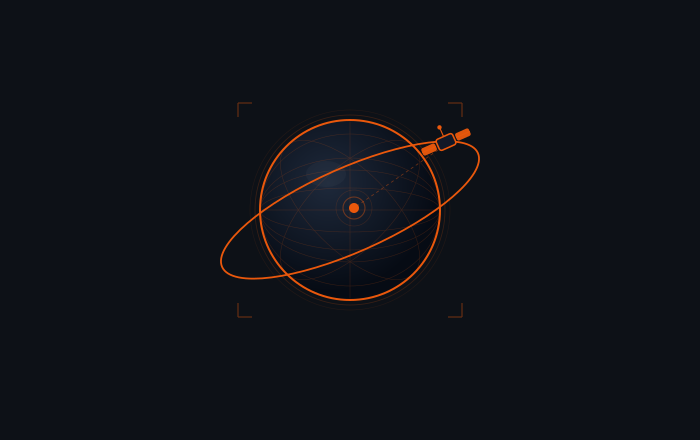

  

# Samuel Appiah Kubi

**Geospatial AI · Open-Source · Ghana**

---

First Class Honours in Geomatic Engineering · KNUST, Ghana · 2024. Admitted to the Copernicus Master's in Digital Earth (Erasmus Mundus) · Salzburg, Austria · 2026. I build production geospatial AI systems — from satellite data acquisition to deep learning inference to web publication.

---

## Open-Source

| Package | Description | License |
|---|---|---|
| [**PyGeoFetch**](https://github.com/appiahkubis14/pygeofetch)  | Search & download from 22+ satellite providers in one command | MIT |
| [**PyGeoVision**](https://github.com/appiahkubis14/PyGeoVision)  | 24 GeoAI subsystems · 14 model architectures · 10 end-to-end pipelines | Apache 2.0 |
| [**raster2pm**](https://github.com/appiahkubis14/raster2pm)  | GeoTIFF → web-ready PMTiles in one command | MIT |

---

## Research

**MMFF** — Multi-Modal Fusion Framework · *IEEE ITS, in preparation*
Camera + IMU + GPS · 30 fps · Depth MAE 0.28 m · 79% jitter reduction · 50 km ground truth

| Project | Result |
|---|---|
| Mars Gully Digital Twin | IoU > 0.65 · F1 > 0.75 on HiRISE/CTX |
| Coastal Erosion Digital Twin | MAE < 8 m · 3-month forecasts |
| IonoForecaster | MAE < 0.08 · 6-hour S4 scintillation |
| Atewa Illegal Mining Detector | Recall 82% · F1 0.79 |

---

## Stack

`PyTorch` `TensorFlow` `YOLOv8` `U-Net` `SegFormer` `SAM` `GDAL` `Rasterio` `STAC` `PMTiles` `Google Earth Engine` `Docker` `AWS` `Python` `Linux`

---

